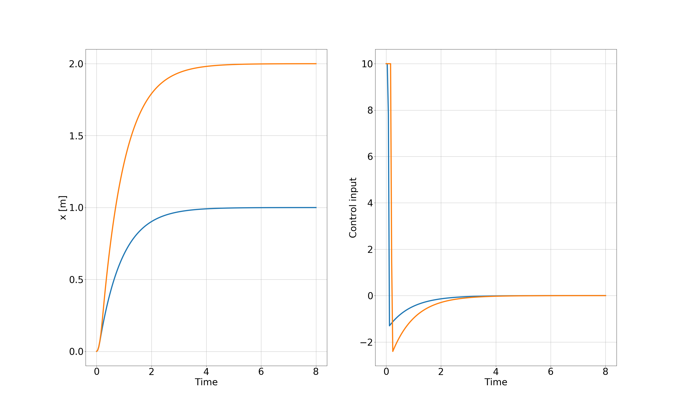
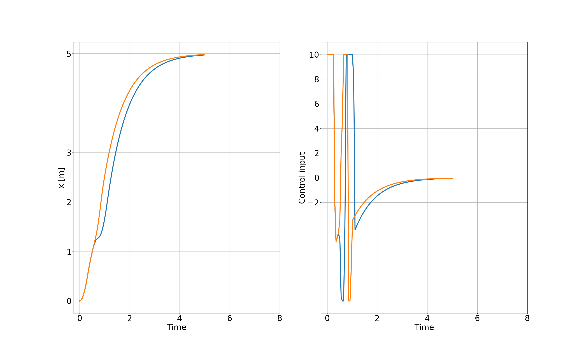
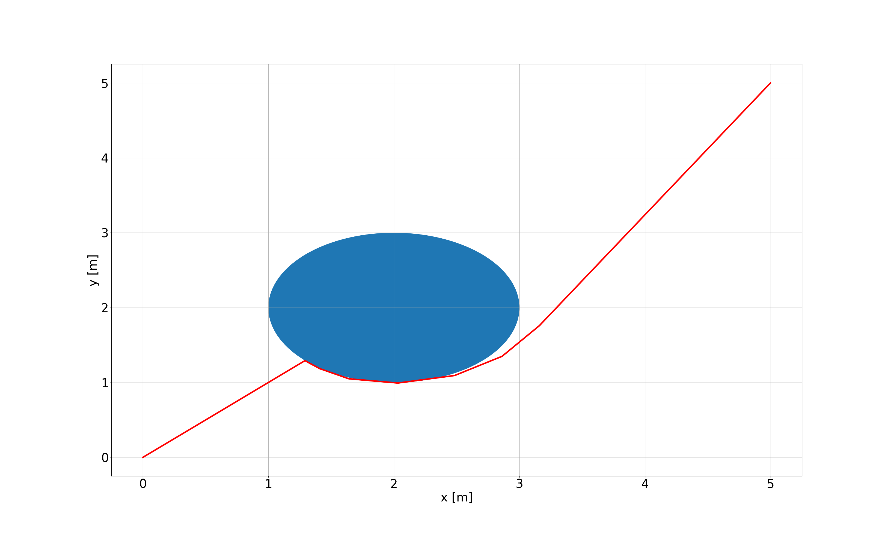
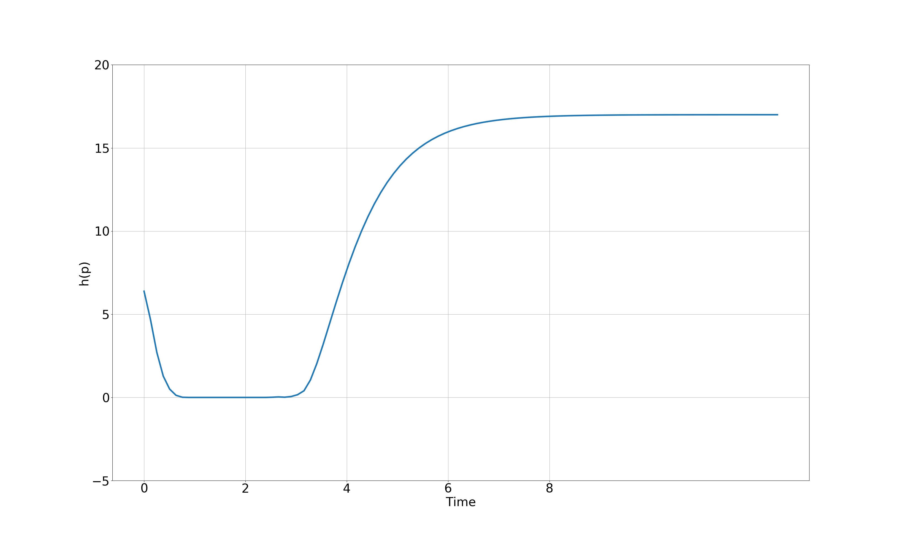

# acados_study

## How to execute the program

```angular2html
python3 example_ocp_2d
```

When executing the command above, it generates json file and 
show the figure below.



## MPC-ECBF

### ECBF formulation 

$`\eta`$





