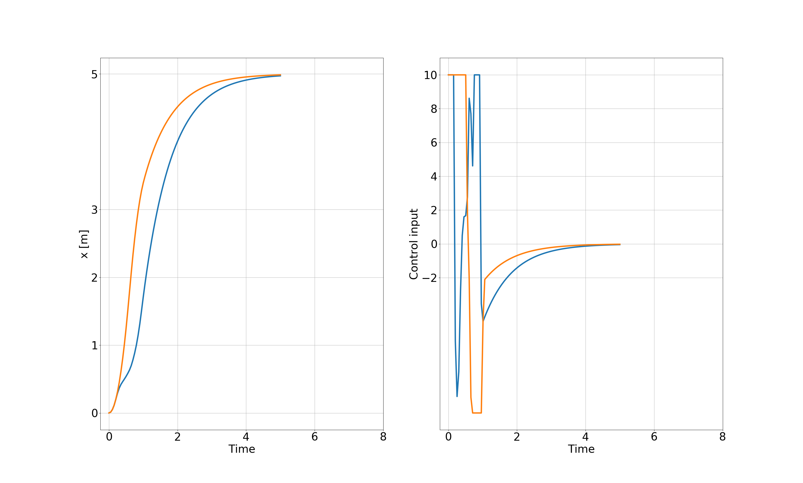
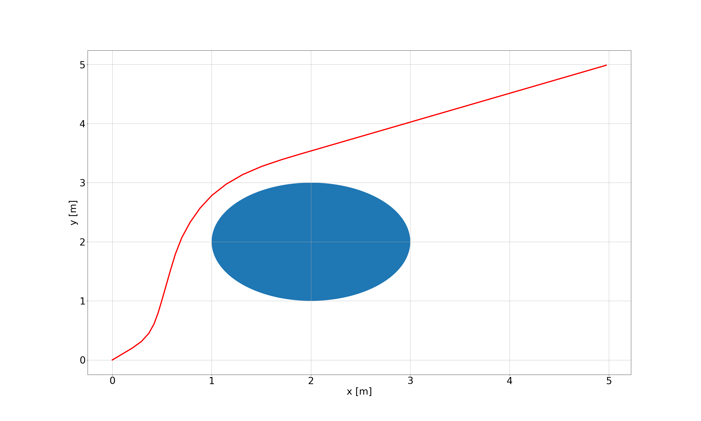
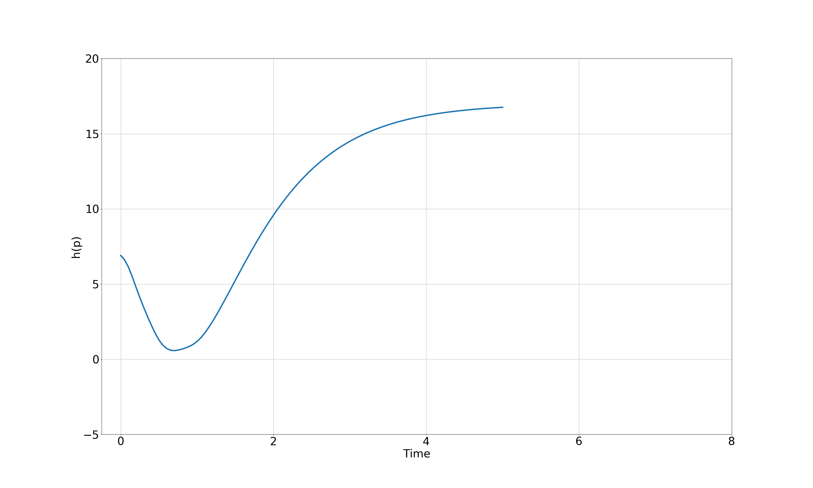

# acados_study

## How to execute the simple model predictive control

```angular2html
python3 example_ocp_2d
```

When executing the command above, it generates json file and 
show the figure below.


## MPC-ECBF

### ECBF formulation 
The vector $\eta_{b}(x)$ can be defined as 
$`\eta_{b}(x) = 
\begin{bmatrix}
h(x)\\
\dot{h}(x)
\end{bmatrix}`$

where $h(x) = (x-x_{obs})^2 + (y-y_{obs})^2$ and

$\dot{h}(x) = 2x(x-x_{obs})+2y(y-y_{obs}).$

The definition of $\mu$ is the following:

$L_{f}^2h(x) + L_{g}L_{f}h(x) =\mu.$

It can be written as 

$\mu = \frac{d^2h(x)}{dt^2}
    =2(\dot{x}^2 + \dot{y}^2)
    + 2(x-x_{obs})\ddot{x}
    + 2(y-y_{obs})\ddot{y}.$

Herein, $\ddot{x}$ and $\ddot{y}$ can be represented as
the force component like
$\ddot{x} = \frac{f_{x}}{m}$ and 
$\ddot{y} = \frac{f_{y}}{m}$, respectively.

According to the [1], 
$\mu\ge -K_{\alpha} \eta_{b}(x)$ should be satisfied.

Due to the dimension of $\mu\in\mathbb{R}$, $K_{\alpha}\in\mathbb{R}^{1\times2}$.

```
Kappa = np.array([64.0, 32.0])

h_expr = get_h(model.x[0:2])
dhdt_expr = get_dhdt(model.x[0:2],model.x[2:4])
mu_expr = get_dh2dt2(model.x[0:2],model.x[2:4],model.u)

ocp.model.con_h_expr = mu_expr 
+ Kappa[0] * h_expr + Kappa[1] * dhdt_expr

ocp.constraints.lh = np.array([0])
ocp.constraints.uh = np.array([1e15])
```







## Moving horizon estimator (MHE)

```
python3 example_mhe_simple_model.py
```

